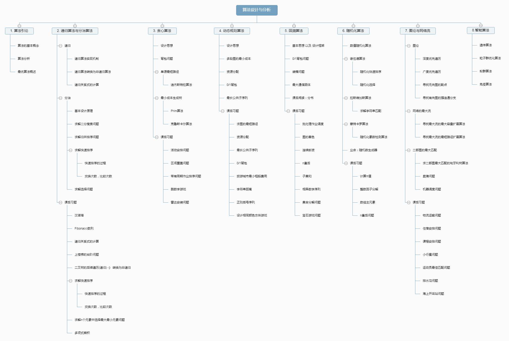

# AlgorithmAnalysisAndDesignTutorial
> 《算法分析与设计教程》 秦明 阅读记录
>
> 

## 知识点

```C
//快速排序
#include <stdio.h>

void swap(int arr[], int x, int y)
{
    int temp = arr[x];
    arr[x] = arr[y];
    arr[y] = temp;
}

int partition(int arr[], int low, int high)
{
    int pivot = arr[low];
    while(low < high)
    {
        while((low < high) && (arr[high] > pivot))
            high--;
        swap(arr, low, high);
        while((low < high) && (arr[low] < pivot))
            low++;
        swap(arr, low, high);
    }
    return low;
}

void quickSort(int arr[], int low, int high)
{
    if(low < high) {
        int pivot = partition(arr, low, high);
        quickSort(arr, low, pivot-1);
        quickSort(arr, pivot+1, high);
    }    
}

void main()
{
    int arr[] = {100, 300, 20, 99, 85, 66, 879, 489, 512, 31};
    quickSort(arr, 0, 9);
    for(int i = 0; i <= 9; i++)
    {
        printf("%d\t",arr[i]);
    }
    
}
```


```c
//图的递归后序遍历

#include <stdio.h>

typedef struct {
    int data;
    struct BiTNode *lchild, *rchild;
} BiTNode, *BiTree;

void PostOrderTraverse(BiTree tree)
{
    if(tree == NULL)
        return;
    
    PostOrderTraverse(tree->lchild);
    PostOrderTraverse(tree->rchild);
    printf("%d ", tree->data);
}
```


## Chapter 1

[总结](http://www.sivan.tech/2019/02/28/%E7%AE%97%E6%B3%95%E5%88%86%E6%9E%90%E4%B8%8E%E8%AE%BE%E8%AE%A1%E6%95%99%E7%A8%8B-Chapter-1/)


## 课后习题代码

## 第1章

1. 解释下列名词：

   >  · 算法：笼统的将算法定义为解决某个确定问题的任意一种特殊方法。

   >  **算法就是一组有穷的规则，它规定了解决某一类型问题的一系列计算方法**

   >  · 频率计数：算法分析而论，一条语句的数量级指的是执行它的频率；对于一个算法而言，它的数量级指的是所有语句频率之和

   > · 多项式时间算法：凡可用多项式来对其计算时间限界的算法，称为多项式时间算法。

   > · 指数时间算法：计算时间只能用指数函数限界的算法称为指数时间算法

2. 算法分析的目的：

   > 1. 可以充分发挥人类的聪明才智
   > 2. 想方设法设计一些好的算法，可以达到少花钱多办事、办好事的经济效果

3. · 事前分析：求得一个算法的时间限界函数

   · 事后测试：确定程序所耗费的精确时间和空间

4. 评价一个算法应从哪几个方面进行考虑

   > 1. 5个特性，确定性，有穷性，输入，输出，能行性
   > 2. 时间复杂度，空间复杂度

5. 对于下列函数，求使得第二个函数比第一个函数小的n的最小值(n为自然数)

   1. $n^2$, $10n$			    **n = 0时**
   2. $2^n$,$2n^3$		               **n = 1时**
   3. $n^2/log_2n​$, $n(log_2n)^2​$       **n = 10时**
   4. $n^3/2, n ^ 2.81$                       **$n^{0.19} > 2$时**

   

   

## 第3章
> 1,2 题目比较简单，自己做

[3 活动安排问题](https://github.com/algorithm-skill/AlgorithmAnalysisAndDesignTutorial/blob/master/%E8%AF%BE%E5%90%8E%E4%B9%A0%E9%A2%98/%E7%AC%AC3%E7%AB%A0/3%E6%B4%BB%E5%8A%A8%E5%AE%89%E6%8E%92.java)

[4 区间覆盖问题(思路)](https://blog.csdn.net/chenguolinblog/article/details/7882316)

[4 区间覆盖问题(思路)](https://www.cnblogs.com/Draymonder/p/7215230.html)

[4 区间覆盖问题(思路 PPT 10页)](https://wenku.baidu.com/view/2717698379563c1ec4da7133.html)

[4 区间覆盖问题(代码)](https://blog.csdn.net/weixin_37605770/article/details/70160342)

[5 带有限期作业排序问题(思路)](https://blog.csdn.net/qq_29617037/article/details/51371460)

[5 带有限期作业排序问题(代码)](https://blog.csdn.net/bajinbajin/article/details/13616059)

[6 删数字游戏](https://blog.csdn.net/yuanxu716/article/details/72974373)

[7 雷达安装问题](https://blog.csdn.net/cax1165/article/details/52563947)

## 第4章
> 1,2,3,4 是小题，没有找，自己做吧

[5 旅游城市](https://www.cnblogs.com/L-Arikes/p/5099270.html)

[6 字符串编辑距离](https://github.com/algorithm-skill/AlgorithmAnalysisAndDesignTutorial/blob/master/%E8%AF%BE%E5%90%8E%E4%B9%A0%E9%A2%98/%E7%AC%AC4%E7%AB%A0/6.c)

[7 正则括号序列(分析)](https://wenku.baidu.com/view/a23c5a2b7375a417866f8f14.html)

[7 正则括号序列(代码)](https://blog.csdn.net/svitter/article/details/25186367)

[8 n个颜色方格(POJ 1390)](https://blog.csdn.net/PKU_ZZY/article/details/51442591)

## 第5章
> 第8题 宝石游戏没有找到答案

[1 批处理作业调度](https://github.com/algorithm-skill/AlgorithmAnalysisAndDesignTutorial/blob/master/%E8%AF%BE%E5%90%8E%E4%B9%A0%E9%A2%98/%E7%AC%AC5%E7%AB%A0/1%E6%89%B9%E5%A4%84%E7%90%86%E4%BD%9C%E4%B8%9A%E8%B0%83%E5%BA%A6.java)

[2 图着色问题](https://wenku.baidu.com/view/7193073c7fd5360cba1adb85.html)

[3 连续邮资问题](https://github.com/algorithm-skill/AlgorithmAnalysisAndDesignTutorial/blob/master/%E8%AF%BE%E5%90%8E%E4%B9%A0%E9%A2%98/%E7%AC%AC5%E7%AB%A0/3%E8%BF%9E%E7%BB%AD%E9%82%AE%E8%B5%84%E9%97%AE%E9%A2%98.java)

[4 n皇后问题](https://github.com/algorithm-skill/AlgorithmAnalysisAndDesignTutorial/blob/master/%E8%AF%BE%E5%90%8E%E4%B9%A0%E9%A2%98/%E7%AC%AC5%E7%AB%A0/4n%E7%9A%87%E5%90%8E.java)

[5 子集和问题(分析)](https://github.com/algorithm-skill/AlgorithmAnalysisAndDesignTutorial/blob/master/%E8%AF%BE%E5%90%8E%E4%B9%A0%E9%A2%98/%E7%AC%AC5%E7%AB%A0/5%E5%AD%90%E9%9B%86%E5%92%8C%E9%97%AE%E9%A2%98%E7%9B%AE.jpg)

[5 子集和问题(核心代码)](https://github.com/algorithm-skill/AlgorithmAnalysisAndDesignTutorial/blob/master/%E8%AF%BE%E5%90%8E%E4%B9%A0%E9%A2%98/%E7%AC%AC5%E7%AB%A0/5%E5%AD%90%E9%9B%86%E5%92%8C%E9%97%AE%E9%A2%98.c)

[6 相异数字序列(分析)](https://max.book118.com/html/2018/0518/167077771.shtm)
    
[6 相异数字序列(代码)](https://blog.csdn.net/beatbean/article/details/8455544)

[7 集合分解](https://www.cnblogs.com/woxiaosade/p/10019520.html)

## 第6章
[1 计算π](https://github.com/algorithm-skill/AlgorithmAnalysisAndDesignTutorial/blob/master/%E8%AF%BE%E5%90%8E%E4%B9%A0%E9%A2%98/%E7%AC%AC6%E7%AB%A0/1%E8%AE%A1%E7%AE%97%CF%80%E5%80%BC.c)

[2 整数因子分解](https://github.com/algorithm-skill/AlgorithmAnalysisAndDesignTutorial/blob/master/%E8%AF%BE%E5%90%8E%E4%B9%A0%E9%A2%98/%E7%AC%AC6%E7%AB%A0/2%E6%95%B4%E6%95%B0%E5%9B%A0%E5%AD%90%E5%88%86%E8%A7%A3.java)

[3 数组主元素问题](https://github.com/algorithm-skill/AlgorithmAnalysisAndDesignTutorial/blob/master/%E8%AF%BE%E5%90%8E%E4%B9%A0%E9%A2%98/%E7%AC%AC6%E7%AB%A0/3%E6%95%B0%E7%BB%84%E4%B8%BB%E5%85%83%E7%B4%A0%E9%97%AE%E9%A2%98.java)

[4 n皇后问题](https://github.com/algorithm-skill/AlgorithmAnalysisAndDesignTutorial/blob/master/%E8%AF%BE%E5%90%8E%E4%B9%A0%E9%A2%98/%E7%AC%AC6%E7%AB%A0/4n%E7%9A%87%E5%90%8E%E9%97%AE%E9%A2%98.java)


## 第7章
> 第1题没有找到答案

[2 住宿安排](https://blog.csdn.net/q22232222/article/details/25038757)

[3 课程安排](https://blog.csdn.net/greatjames/article/details/75668477)

[4 小行星问题](https://blog.csdn.net/forpro_yang/article/details/6650838)

[5 运动员最佳匹配](https://blog.csdn.net/Matrix97/article/details/80794959)

[6 排水沟问题](https://blog.csdn.net/u014141559/article/details/43709481?utm_source=blogxgwz7)

[6 排水沟问题(代码)](https://blog.csdn.net/qq_37685156/article/details/78652193)

[7 海上开采站](https://blog.csdn.net/q22232222/article/details/25060365)

